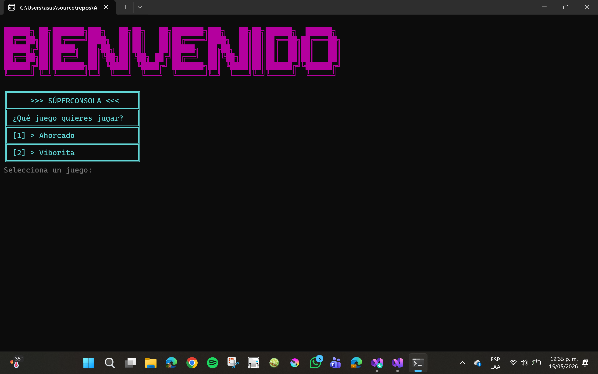
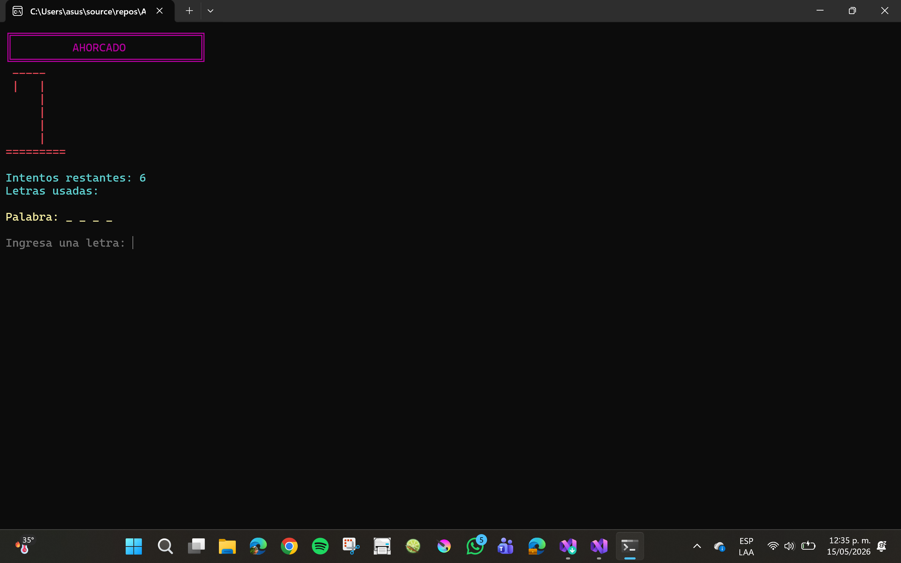
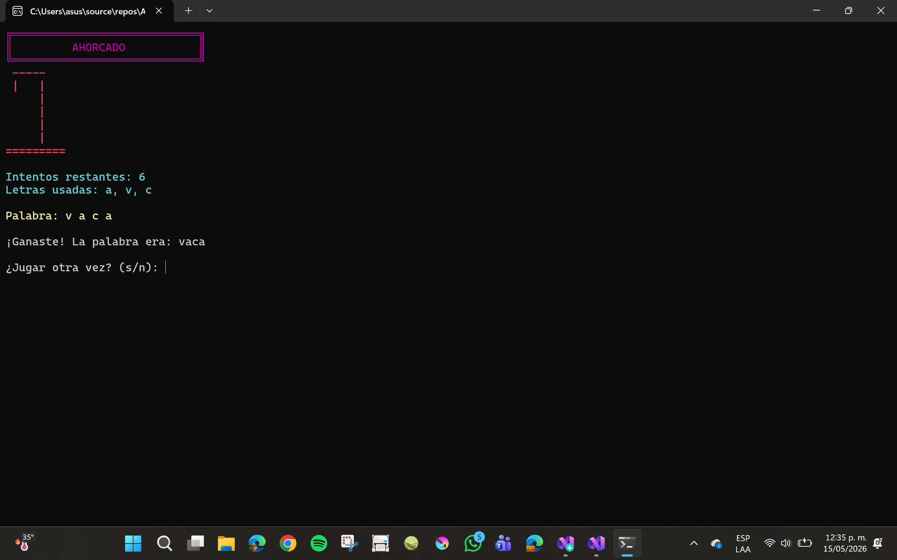
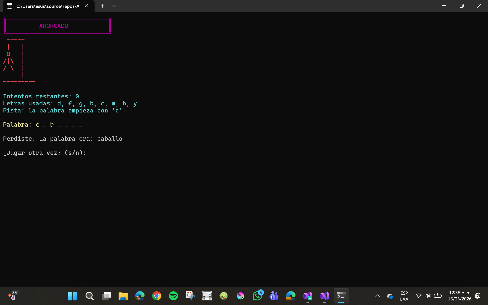
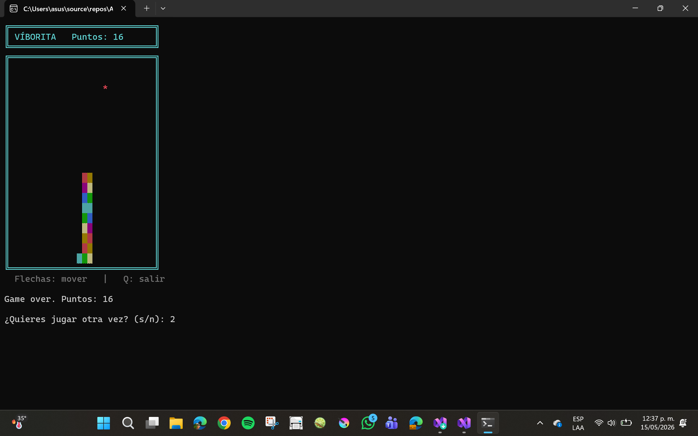

# SÚPERCONSOLA

Un proyecto realizado en C# y .NET en el que incluye dos minijuegos:

- Ahorcado
- Viborita

Esta actividad fue desarrollada utilizando los conceptos vistos en la materia de Arquitectura de Software.

---

# CARACTERÍSTICAS DE LA ACTIVIDAD

El proyecto trajo consigo dos juegos:

## AHORCADO & VIBORITA

### ¿Qué juego quieres jugar

| AHORCADO | VIBORITA|
|---|---|
| Sistema de categorías | Movimiento en tiempo real |
| Pistas automáticas | Sistema de puntos |
| Sistema de puntos | Colisión |
| Detección de victoria y derrota | Reinicio de partida |
| Interfaz decorada en consola | Interfaz estilo arcade |
| Colores dinámicos | Colores arcoíris en la serpiente |

---

## TECNOLOGÍAS UTILIZADAS

| Tecnología | Uso |
|---|---|
| C# | Lenguaje principal |
| .NET | Framework |
| POO | Arquitectura del proyecto |
| Consola | Interfaz visual |

---

## CAPTURAS DEL PROYECTO

### Menú principal



---

## Juego del Ahorcado



## Ganaste



## Perdiste



---

## Juego de la Viborita



---

# ¿CÓMO EJECUTAR EL PROYECTO?


## Estructura del proyecto

```bash

AhorcadoTSW/
│
├── Ahorcado.cs
├── ConsolaUI.cs
├── ConsolaUIViborita.cs
├── IMotorJuego.cs
├── IMotorViborita.cs
├── IRepositorioPalabras.cs
├── MotorAhorcado.cs
├── PalabrasEnMemoria.cs
├── Program.cs
└── README.md
```

---

---
